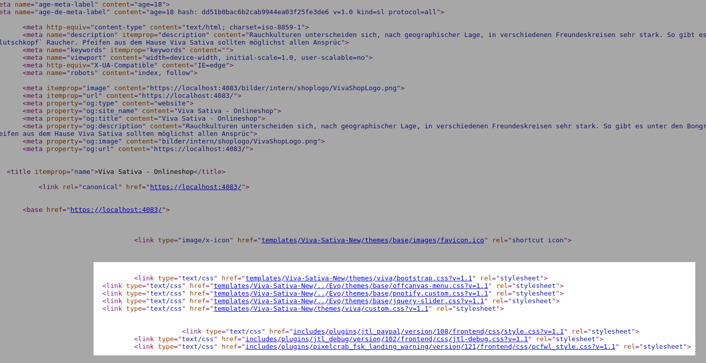
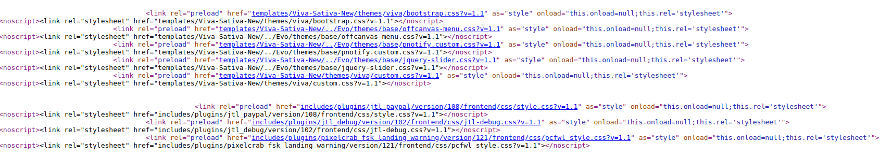

# JTL Shop4 Plugin - LoadCSS

- [JTL Shop4 Plugin - LoadCSS](#jtl-shop4-plugin---loadcss)
    - [Features](#features)
    - [Installation](#installation)
    - [Anleitung](#anleitung)
        - [Einstellungen](#einstellungen)
    - [Vorschau](#vorschau)
        - [Demo](#demo)
        - [Screenshots](#screenshots)
    - [Geplante Features](#geplante-features)
    - [Unterstützen](#unterst%C3%BCtzen)

Mit diesem Plugin können ein paar kleine CSS Optimierungen vorgenommen werden welche das PageSpeed Ranking bei Google verbessern. Es fügt kritisches CSS ein und macht andere Stylesheets preload fähig.

## Features

- Einfügen von Standard CriticalCSS extrahiert vom Evo Default Template
- Preload von CSS Dateien mit Fallback LoadCSS

## Installation

Gehen Sie auf der Github Seite auf "Releases" und laden Sie die letzte Version herunter. Diese können Sie im Shop Backend unter Plugin Verwaltung hochladen, installieren und/oder aktualisieren.

## Anleitung

Sobald das Plugin installiert ist müssen Sie noch in den Einstellungen von diesem Plugin die benötigten Optionen aktivieren.

### Einstellungen

Siehe [SETTINGS.md](SETTINGS.md).

## Vorschau

### Demo

Einen Demo Shop wo das Plugin aktiv in Verwendung ist findet man unter [shop.vivasativa.at](https://shop.vivasativa.at). Um die Anpassungen zu sehen müssen Sie mit Rechtsklick auf "Seitenquelltext anzeigen" gehen und oben im Head Bereich auf die Änderungen des CSS im Head Bereich achten.

### Screenshots

| Vorher | Nachher |
|-|-|
|  |  |

## Geplante Features

- [ ] Dynamisches laden von CriticalCSS

## Unterstützen

Falls ihr mir was als BTC o.ä. spenden wollt, könnt ihr dass auf folgende Adressen tun:

- Bitcoin (BTC): 19FXuMSR1yoApqZ9VkY1e8bhxHp4fqK4ZB
- Ether (ETC): 0x45dAC2c1647B505Dc3a4E48FAa3443bbEAf6eBF2
- Bitcoin Cash (BTH): qpdgpgp78r5ql8c9tjtkc4ex82s09hc4a5tsralx4g
